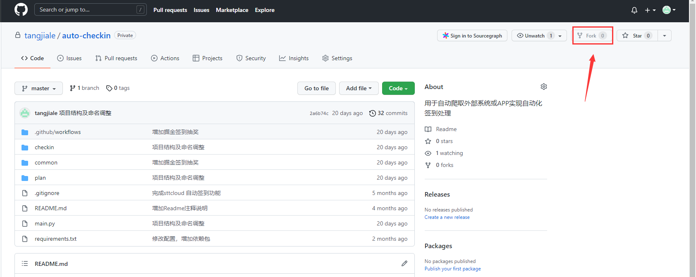
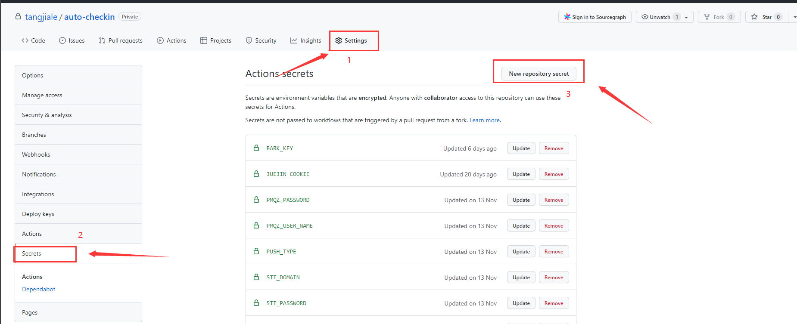
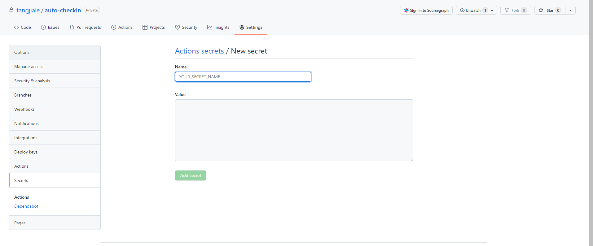
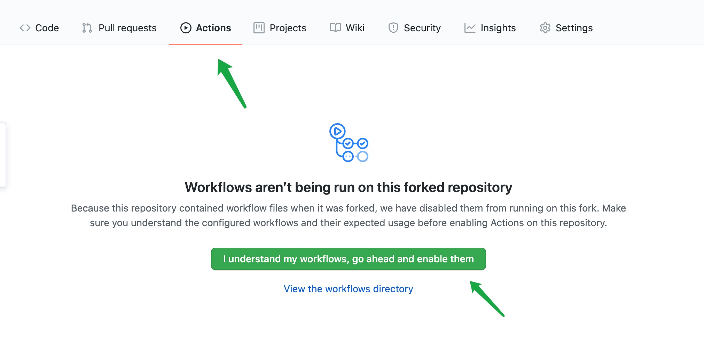

## 每日自动签到，自动抽奖
本项目使用`Github Action`来部署自动签到程序，无需自己购买服务器，安全可靠且方便。另外支持微信公众号通知和IOS的BarK通知，签到完成和中了大奖第一时间便可知晓。

## 支持的自动签到应用
1. 人人都是产品经理(签到获得积分)
2. Stt Cloud（签到获得流量）
3. 管理圈APP（签到获得积分）
4. 有道云笔记（签到获得存储空间）
5. 掘金（签到获得砖石和抽奖）
6. 虎课网（签到获得虎课币）

### 使用方式
1. `fork` 本项目。

2. 依次点击【Setting】、【Secrets】、【New repository secret】。

3. 把 Name 设置为 环境变量KEY,Value为环境变量的VALUE.

环境变量参数根据签到产品设置
 - 人人都是产品经理
    WSPM_USER_NAME = 账号
    WSPM_PASSWORD = 密码
 - Stt Cloud
    STT_DOMAIN = 域名
    STT_USER_NAME = 账号
    STT_PASSWORD = 密码
 - 掘金
    JUEJIN_COOKIE = 个人cookie
 - 有道云笔记
    YNOTE_COOKIE = 个人Cookie
 - 管理圈
    WSPM_USER_NAME = 账号
    WSPM_PASSWORD = 密码
 - 虎课网
    HUKE_COOKIE = 个人Cookie
4. 允许 Github Actions 工作流。

### 定时任务执行时间修改
本程序默认是在北京时间10点去执行，如果需要修改签到时间，可以修改`.github/workflows/check_in.yml`文件中的`cron`字段，该字段文档可以[查看这里](https://docs.github.com/en/actions/reference/events-that-trigger-workflows)。

### 接入通知消息
目前支持两种通知消息：1: 微信公众号通知；2：IOS的Bark APP通知
在 Github 的 Secrets 增加
PUSH_TYPE = WX 或者 BARK
#### 微信公众号通知
微信公众号通知采用WxPusher微信推送服务，具体配置[参考文档](https://wxpusher.zjiecode.com/docs/#/)
获取APP token 和 微信UID 并设置Secrets 增加参数
WEIXIN_APP_TOKEN = APP Token
WEIXIN_UID = 微信UID
#### IOS的BARK APP通知
在IOS 应用商店下载Bark app,并获取key 设置环境变量
在 Github 的 Secrets 增加参数
BARK_KEY = Bark Key